
<h1 align="center">基于Java Web的怀旧唱片售卖系统+vue</h1>

## 简介
怀旧唱片售卖系统：角色分为管理员、用户；实现商品管理、订单管理、用户中心、商品评价、公告信息、购物车、支付功能等模块。    --计算机毕业设计源码；毕设源码；java毕业设计源码

## 联系方式

<h3 align="center">获取完整代码与数据库文件 + 微信：deepguan QQ: 86050149 QQ群: 783742310</h3>

<h3 align="center">可帮忙远程部署 包运行成功！提供远程部署、修改代码、设计文档指导、代码讲解等服务！</h3>

## 功能介绍（完整见运行截图）
管理员：管理员可以通过后台管理界面进行商品、订单、用户评价的管理，操作包括新增、查看、修改和删除。同时，管理员有权限设置，能够进行订单的发货操作和处理用户的评价反馈，通过管理导航可以访问个人中心、管理员管理、商品管理和公告管理等页面。

用户：用户登录后可以通过导航栏访问网站的各个主要功能模块，包括查看商品详情、加入购物车、立即购买等操作。在个人中心，用户能够管理自己的个人信息和收货地址，也可以查询订单状态、申请退款或退货。在购物体验中，用户可以使用不同的支付方式进行结算。

游客：游客可以浏览唱片列表及商品详情，但需要登录后才能进行评论或者购买操作。在网站首页可查看商品推荐、公告信息和热门唱片，网站提供了搜索功能方便游客查找特定商品或者公告。游客还可以通过首页导航栏访问公告信息和管理页面的部分栏目。

## 运行截图
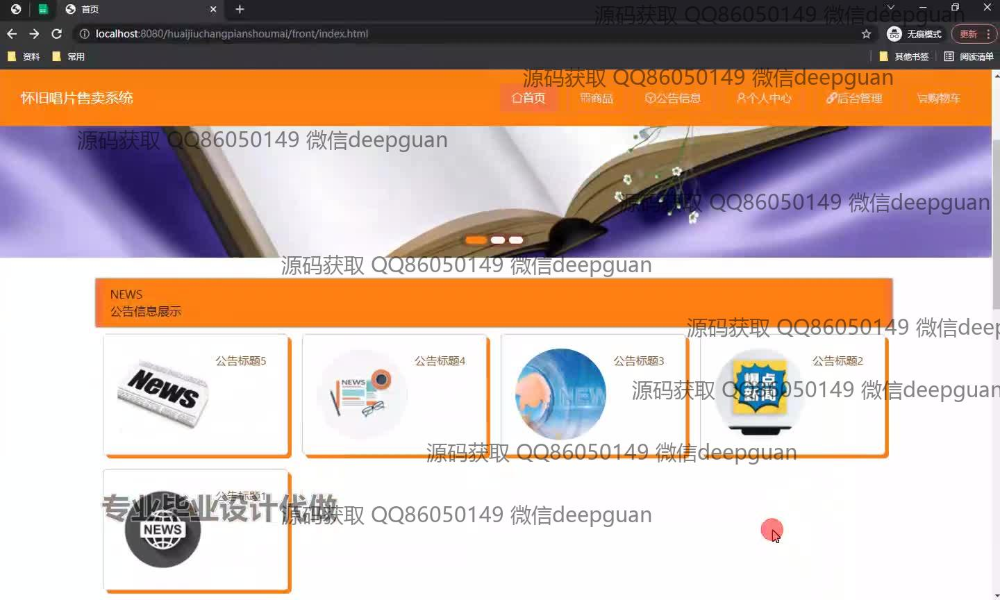
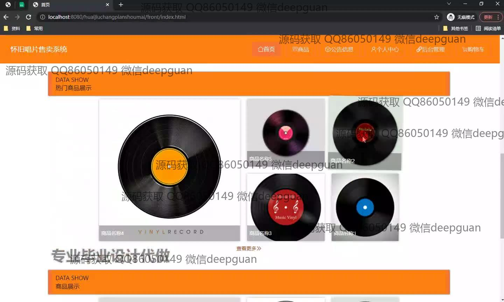

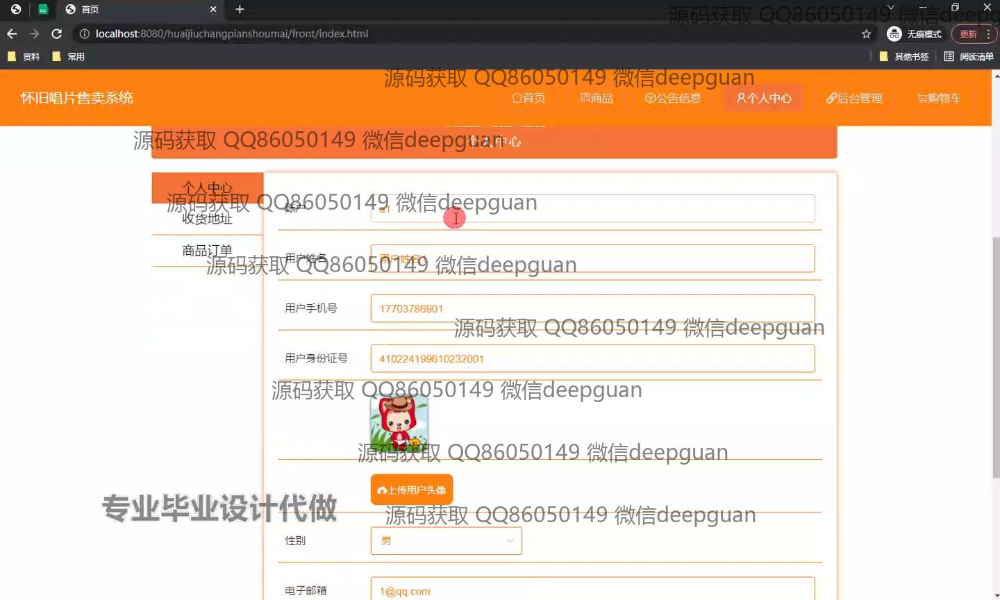
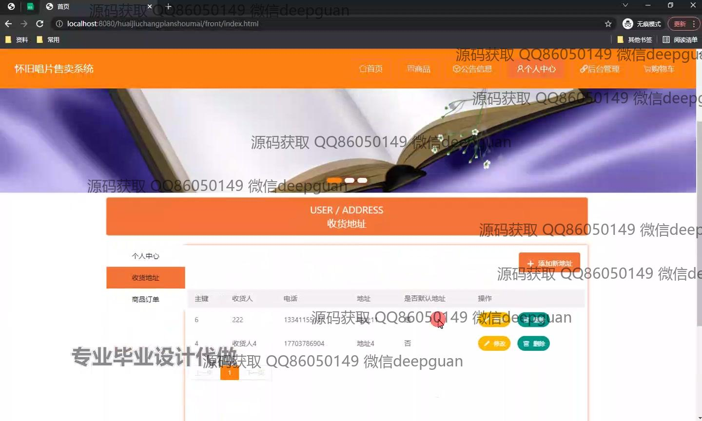
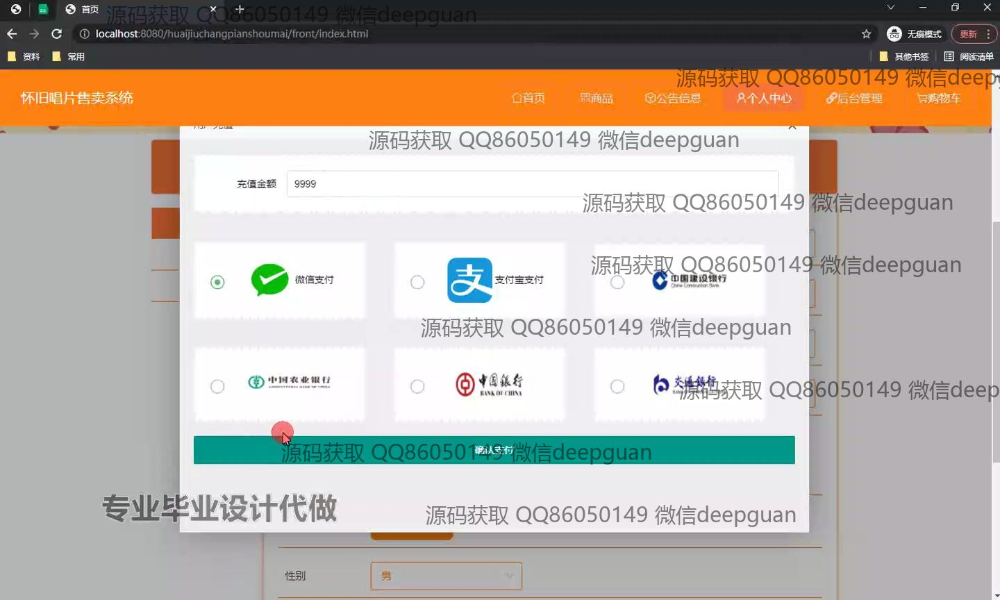
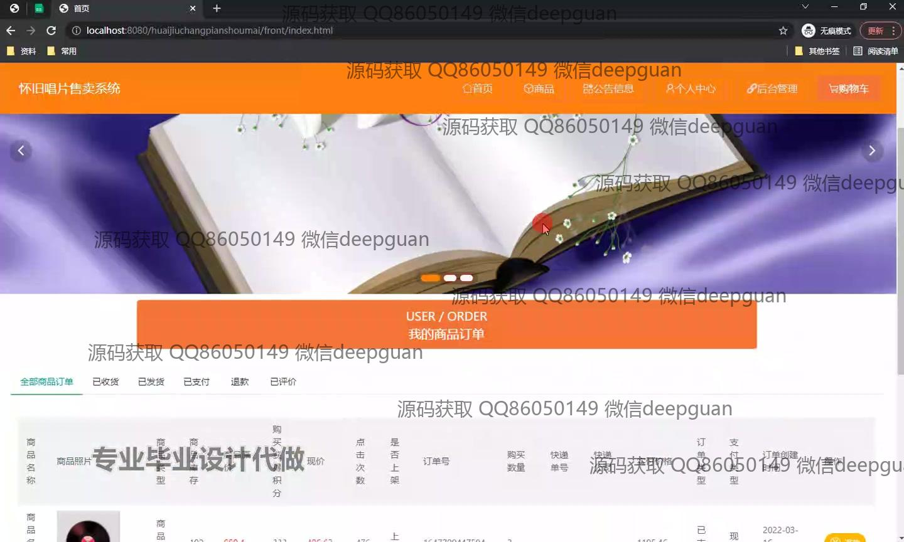
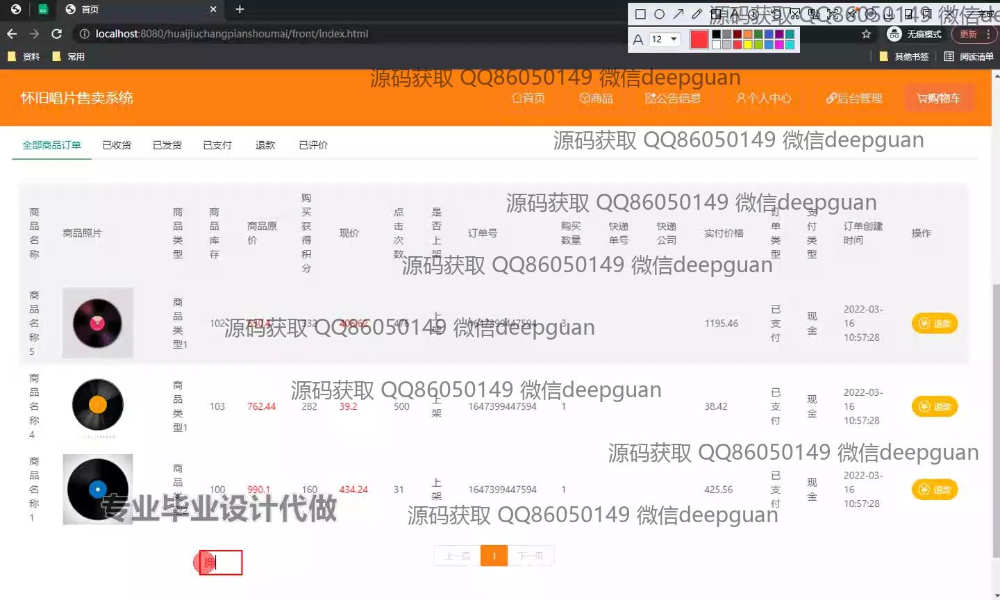
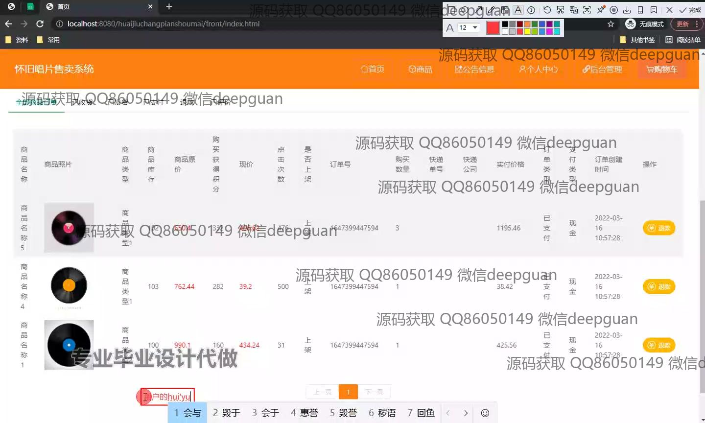
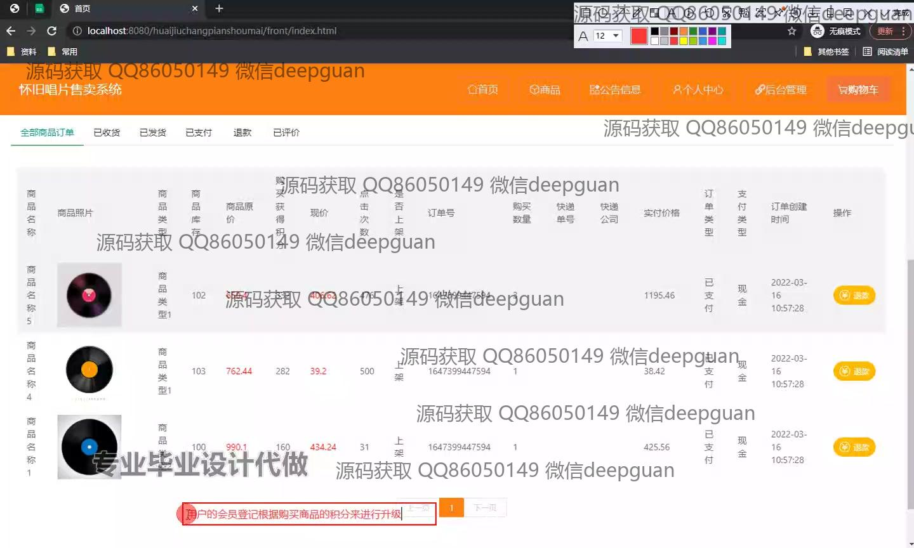
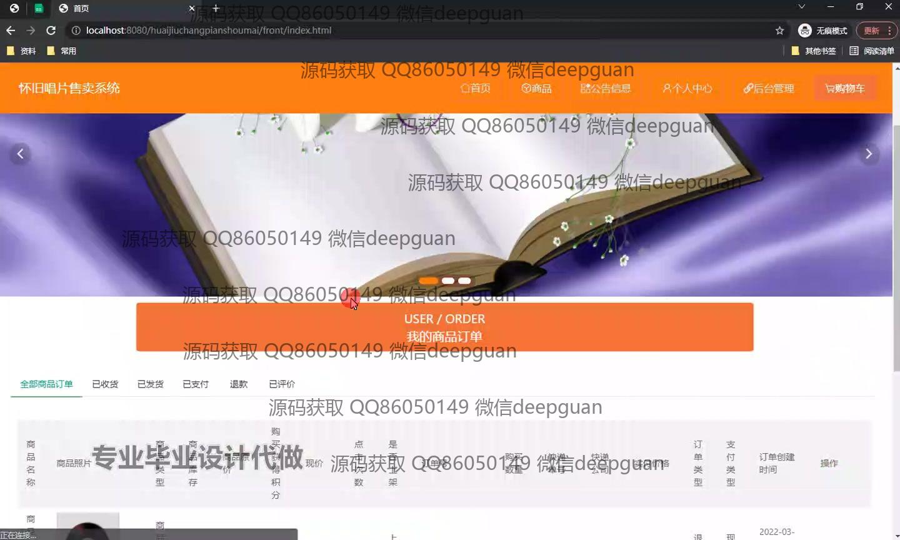
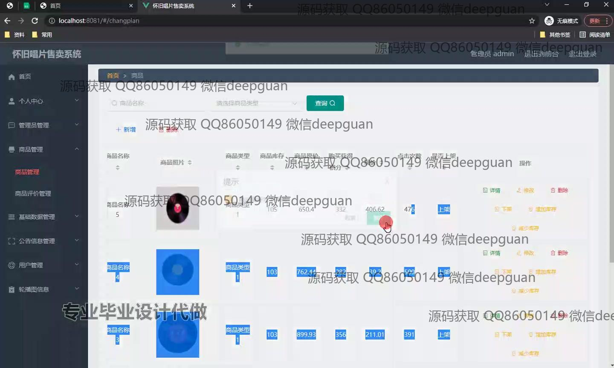
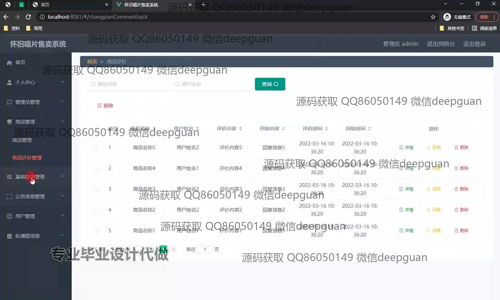
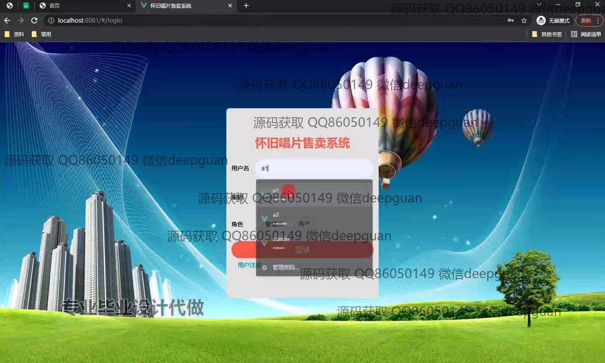
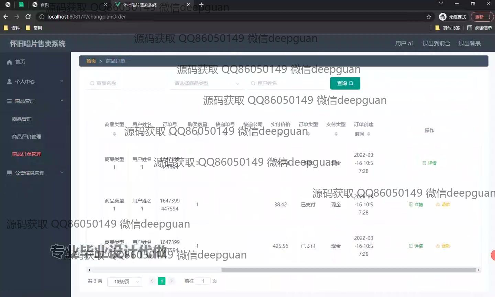
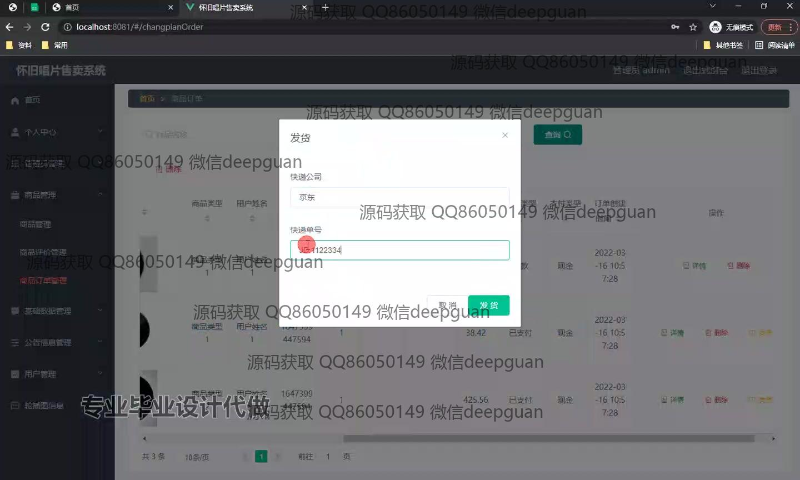
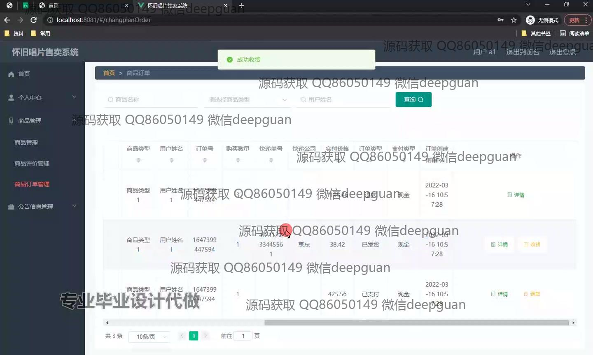
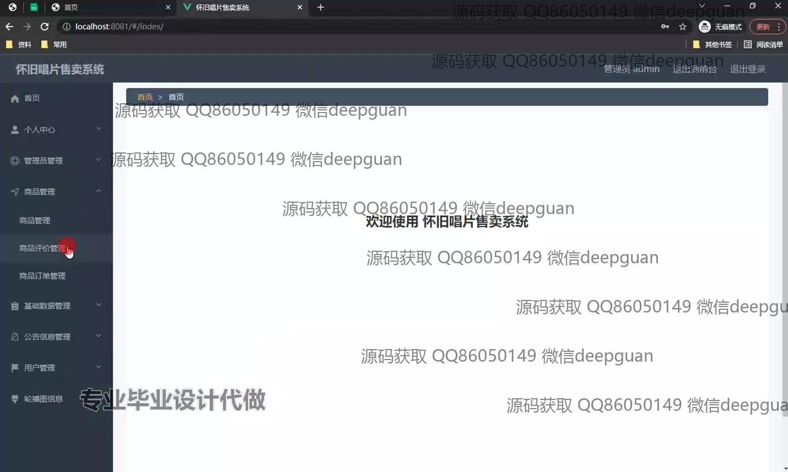

本代码来源于网络,仅供学习参考使用!

